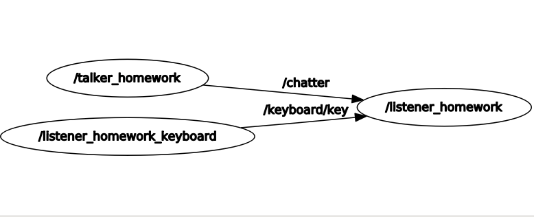
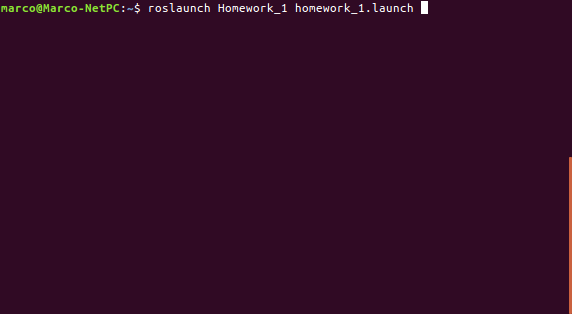

#Homework_1
This file is distributed under the terms of the GNU Lesser General Public License (Lesser GPL)

Homework_1 is distributed in the hope that it will be useful,
but WITHOUT ANY WARRANTY; without even the implied warranty of
MERCHANTABILITY or FITNESS FOR A PARTICULAR PURPOSE.  See the
GNU Lesser General Public License for more details.

You should have received a copy of the GNU Lesser General Public License
along with Homework_1. If not, see <http://www.gnu.org/licenses/>.

=Description=

The files in Homework_1 contain the ROS based implementation for
realize three node where first one publish every second a message(contains name,age and bachelor's),
the second one allows the user to select from the keyboard which part of the message to display on the screen 
and the last one print the part of the message selected by the user previously.

=Implementation=

The "talker_homework" node publish every second a personalized message in "chatter" topic (for more information about the structure of message see message.msg file in msg directory).
The "listener_homework_keyboard" node listen the keyboard and when the user type a key publish a message in "keyboard/key" topic.
The "listener_homework" node listen the "chatter" topic and the "keyboard/key" topic and use the information in these topics to choose
what part of message to display on the screen.

This is the rqt_graph of the package

=How to launch=

In the terminal type the command :

roslaunch Homework_1 homework_1.launch

Please, report suggestions/comments/bugs to 
marco.zenere@studenti.univr.it

